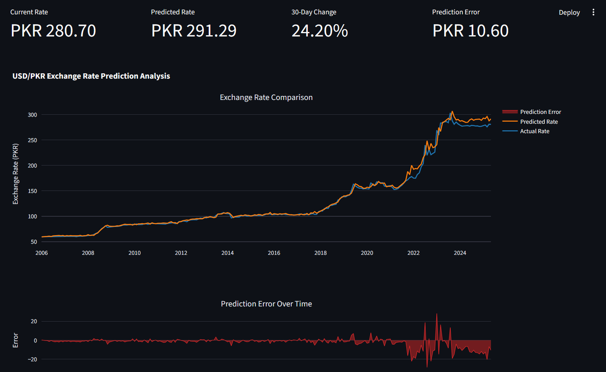
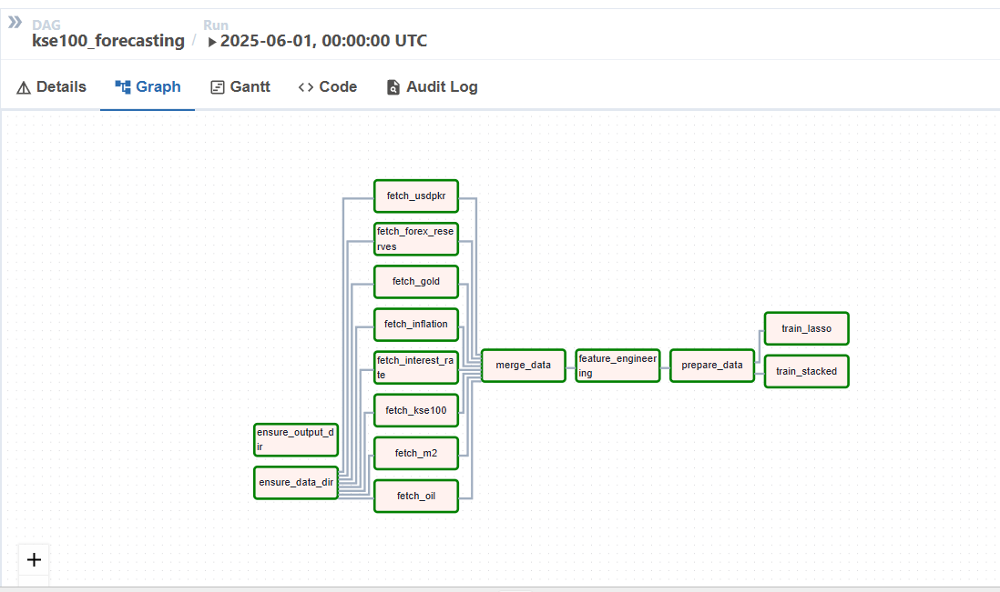
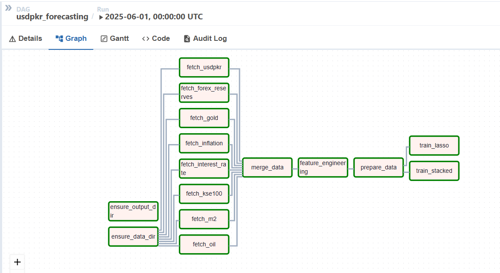

# KSE-100 & USD/PKR Forecasting Pipeline

A modular data pipeline and machine learning system for forecasting the KSE-100 index and the USD/PKR exchange rate using macroeconomic indicators. The project leverages Apache Airflow for orchestration, supports robust feature engineering, and outputs results for visualization in Streamlit.

---

## Overview

This project implements an end-to-end pipeline for financial forecasting using multiple economic indicators. The system ingests data, transforms it for time series analysis, engineers features, trains several machine learning models, and outputs predictions and performance metrics for visualization.

---

## Features

- **Automated Data Ingestion**: Loads macroeconomic and market data from CSVs (expandable to APIs)
- **Data Transformation**: Cleans, merges, and engineers features for time series forecasting
- **Feature Engineering**: Creates lagged, rolling, and cyclical features
- **Multiple Models**: Supports LSTM, ARIMAX, GBRegressor, and Lasso
- **Model Evaluation**: Compares models using RMSE, MAE, and R²
- **Airflow Integration**: Orchestrates the pipeline with modular DAGs
- **Streamlit Dashboard**: Outputs formatted data for dashboarding

---

## Project Structure

```
Project directory/
├── dags/
│   ├── kse100_forecasting_dag.py         # Airflow DAG for KSE-100 forecasting
│   ├── usdpkr_forecasting_dag.py         # Airflow DAG for USD/PKR forecasting
│   ├── kse_modules/                      # Modular pipeline for KSE-100
│   │   ├── ingest.py
│   │   ├── transform.py
│   │   ├── model_steps.py
│   │   └── model.py
│   └── inflation_modules/                # Modular pipeline for USDPKR-Exchange-rate 
│       ├── ingest.py
│       ├── transform.py
│       ├── model_steps.py
│       └── model.py
├── data/
│   ├── raw/                              # Raw macroeconomic and market data
│   ├── model_output/                     # Model outputs and metrics
│   └── models/                           # Trained models and feature sets
├── images/                               # Pipeline and dashboard diagrams
├── src/                                  # Standalone scripts for ingest, transform, model, visualize
├── docker-compose.yaml                   # Multi-service orchestration (Airflow, Postgres)
├── DockerFile                            # Custom Airflow image with dependencies
├── requirements.txt                      # Python dependencies
└── README.md                             # Project documentation
```

---

## Pipeline Workflow

1. **Data Ingestion**: Loads CSVs for KSE-100, USD/PKR, macroeconomic indicators (oil, gold, forex reserves, etc.)
2. **Data Transformation**: Cleans, merges, and aligns data on a monthly basis; handles missing values and outliers
3. **Feature Engineering**: Adds lagged, rolling, cyclical, and economic features
4. **Model Training**: Trains and evaluates multiple models (LSTM, ARIMAX, GBRegressor, Lasso) and stacks them on a LinearRegression meta model.
5. **Model Evaluation**: Outputs metrics and predictions for comparison
6. **Serialization**: Saves models, metrics, and selected features for downstream use
7. **Visualization**: Generates interactive Streamlit dashboard and deploys automatically on vercel. 

---

## Data Sources

- **Raw Data**: Place CSVs for KSE100, USD/PKR, OIL, GOLD, FOREX_RESERVES, INTEREST_RATE, INFLATION, M2 in `data/raw/`
- **Engineered Features**: Output to `data/raw/engineered_features.csv`
- **Model Outputs**: Metrics and predictions in `data/model_output/`
- **Trained Models**: Pickle files in `data/models/`

---

## Airflow DAGs

- `kse100_forecasting_dag.py`: Orchestrates the KSE-100 forecasting pipeline
- `usdpkr_forecasting_dag.py`: Orchestrates the USD/PKR forecasting pipeline

Each DAG uses modular steps from `dags/kse_modules/` or `dags/inflation_modules/` for ingestion, transformation, and modeling.


---

## Streamlit Dashboard

Below is a sample dashboard generated from the model outputs, visualized in Streamlit through interactive graphs made by Plotly:



## DAG Visualizations

Below are visual representations of the two main DAGs in this project:

**KSE-100 Forecasting DAG:**



**USD/PKR Forecasting DAG:**



---

## Docker & Airflow

The project is containerized for reproducibility and ease of deployment.

- **docker-compose.yaml**: Spins up Airflow (webserver, scheduler) and Postgres
- **DockerFile**: Customizes the Airflow image with required Python dependencies

### Quickstart

You can pull a pre-built Docker image for this project from DockerHub:

```bash
docker pull ibrahimkiani/pkrexchange_equityriskmodelling
```

Or build and start the Airflow stack locally:

```bash
# Clone the repository
git clone https://github.com/Ibrahim-Kiani/USDPKR-Exchange-Rate_Equity-Risk-Platform.git
cd inflation\ forecasting

# Build and start the Airflow stack
docker-compose up --build
```

- Access Airflow UI at [http://localhost:8080](http://localhost:8080)
- Place your raw data in `data/raw/`
- Enable and trigger the desired DAG

---

## Python Dependencies

See `requirements.txt` for a full list. Key packages:
- pandas, numpy, scikit-learn, yfinance, pandas_datareader, openpyxl, joblib, requests

---

## Streamlit Visualization

- Go to the main directory and call
```
    streamlit run dashboard.py
```

---

## Results & Metrics

Model performance is output as CSV and JSON for easy comparison and visualization. Example metrics include RMSE, MAE, and R² for each model.

---

## Extending the Pipeline

- Add new data sources by placing CSVs in `data/raw/` and updating the ingestion logic
- Add new models by extending `model_steps.py` in the relevant module
- Customize feature engineering in `transform.py`

---

## License & Credits

- Based on the original inflation forecasting pipeline by [original authors/your team]
- See LICENSE for details


